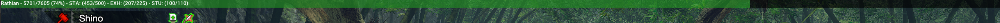

# mhrise-monster-info
A mod for Monster Hunter Rise that shows information about the nearest large monster

## Features
* Designed to work without reframework-d2d, so it works well on Linux with Proton (including Steam Deck)
* Show Name
* Show HP
  * Blue if catchable
* Show ailments and its proc durations
* Configurations:
  * Enabled while offline
  * Enabled while offline
  * What ailment should be shown
  * Show ailment if > 0

## Requirements
* Reframework

## Credits
* Base code is from `Monster Has HP` mod
* MHR Overlay and Coavis Damage Meter for information on how to extract data

